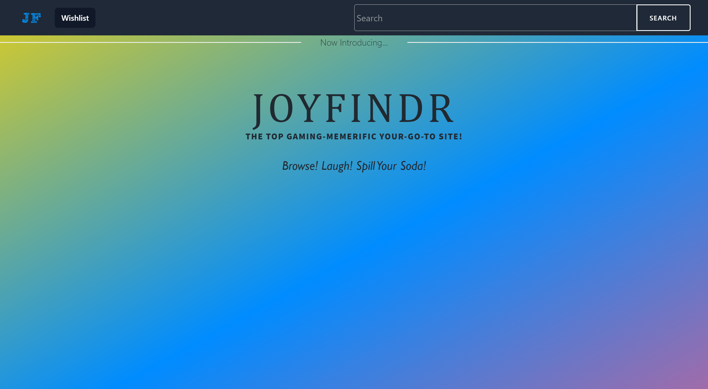
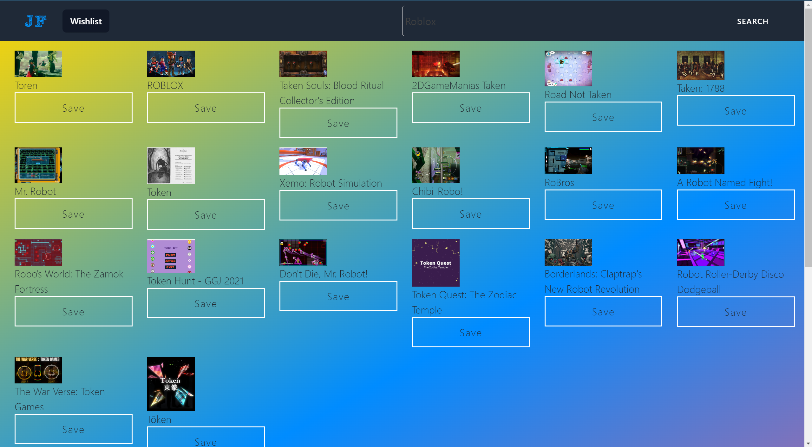
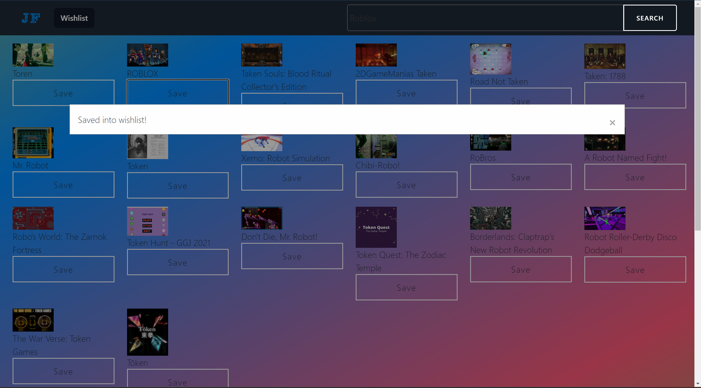
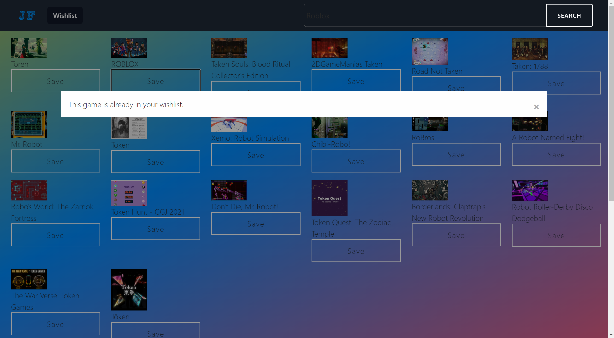
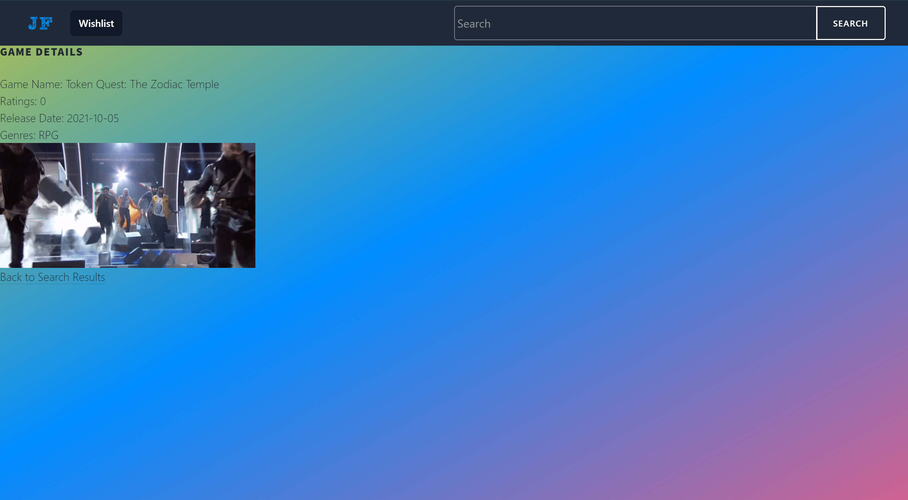

# JoyFindR

## Table of Contents
1. Description 
2. Installation 
3. Screenshot 
4. Usage
5. Support 
6. Credits
7. License

## Description 

Is a webapp that acts as a game library storage, given that a user enters what games they want to save, while alongside it, will also return memes with the output of the game description. Using APIs from https://rawg.io/apidocs and https://developers.giphy.com/.

## Installation 

No need for any installation! Just search for https://stevendreed.github.io/JoyFindR/ on your browsers!

## Screenshot 

## Usage 

Usage will consist of searching for game titles using an input field, where the results will gradually be displayed on screen as the user hits submit. Upon clicking 'Search', the request will be sent to the API, where it will send back a response to the client in HTML form. The indicated game that was entered will eventually be returned in several results with a 'Save' button below each result to indicate whether the user wishes to have them saved to their Wishlist for a future reference. As the user clicks on a game, the person will then be taken to a game info page, where the indicated game's release date, ratings, and genres will be returned, with a corresponding meme gif that will also be displayed to add some humor.

## Support 

The application utilizes third-party software from websites, such as Rawg.io or Giphy.com. Using HTML, CSS, and JavaScript, the application will emphasize code logic to successfully adhere to the user’s interactions and to be visually appealing

## Credits 

The application was done by the following contributors:

Danny Collan
Steven Reed
Zachary Gutierrez
Darrel Saephan
Franklin Membreno

If you would like to contribute to the development of the project, please do not hesitate to reach out to any team member for a request. Thank you!

## License 

Please refer to the LICENSE in the repo.